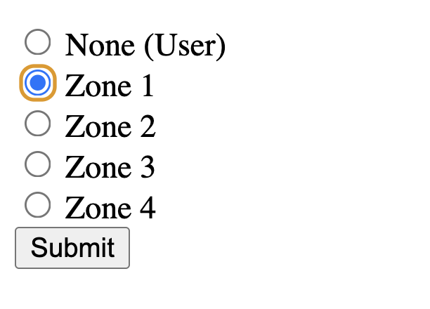
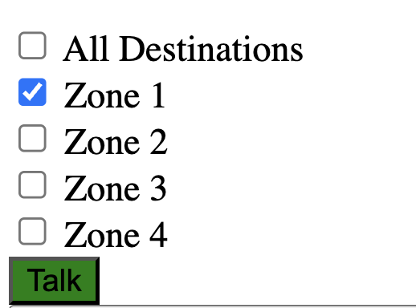
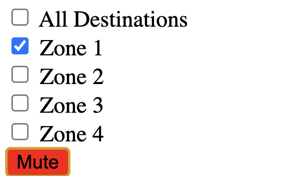

# Intercom at The Yard
tion for real-time voice communication between different zones at Tandon's Navy Yard facility, NYU Tandon at The Yard. 

It is made using p5LiveMedia by @vanevery, an implementation of WebRTC and socket.io using p5.js. For more information on p5LiveMedia see Shawn's [github repo](https://github.com/vanevery/p5LiveMedia).

## Usage
Deploy the website using a unique room name. This is configured when a new p5lm object is instantiated.

```
p5lm = new p5LiveMedia(this, "CAPTURE", stream, "unique-room-name");
```
Otherwise you might experience crosstalk with other users of this repo!

Select a zone and click submit. This should be left running and connected to a speaker to act as an intercom endpoint. 


Selecting a zone allows other users of the website to unmute their microphone feed on that peer connection when pressing the "Talk" button. 



Be sure to press the "Mute" button when you are done talking...


