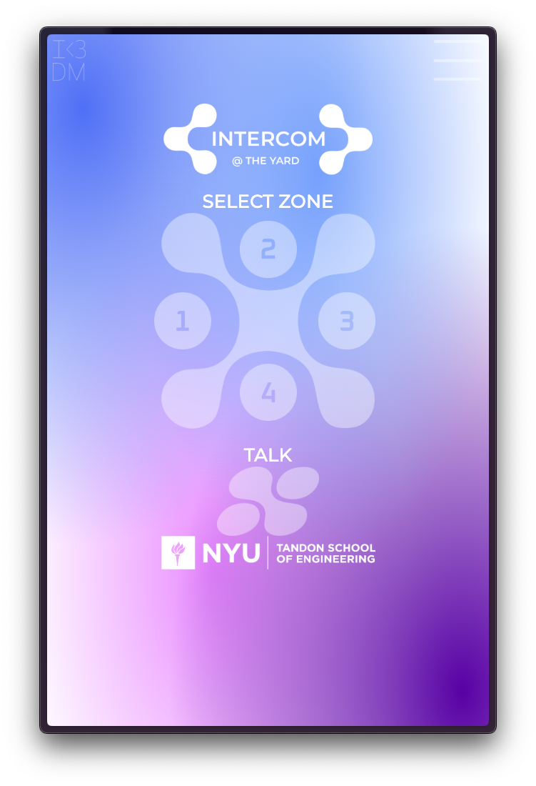
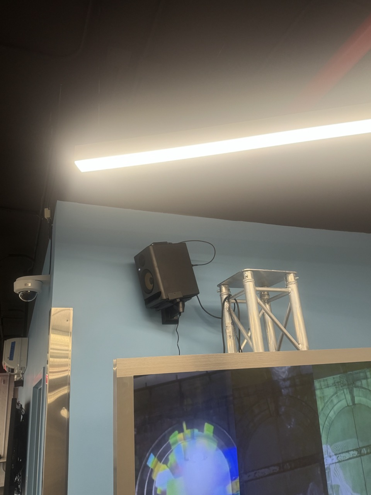
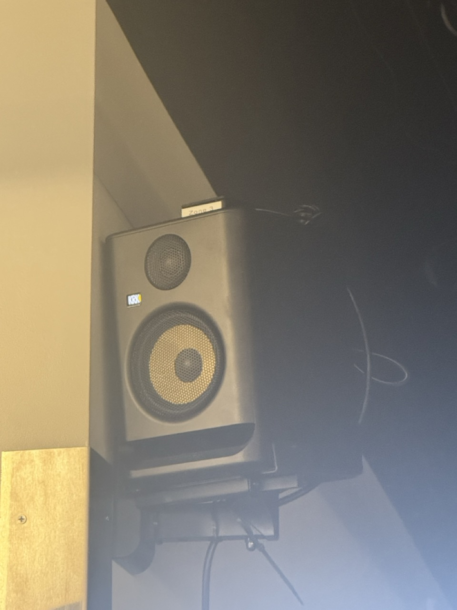
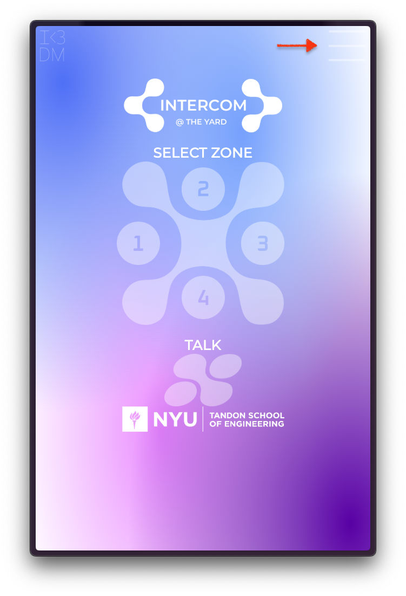
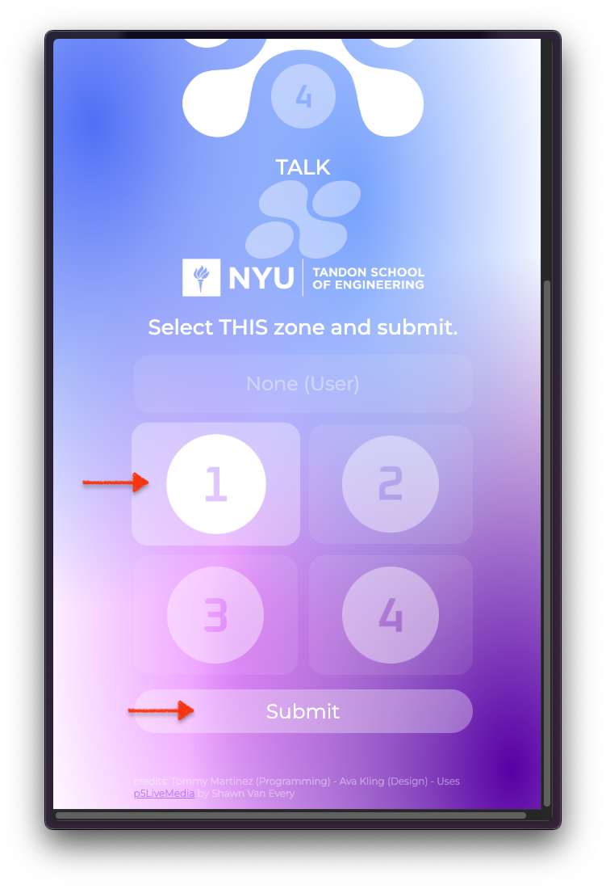
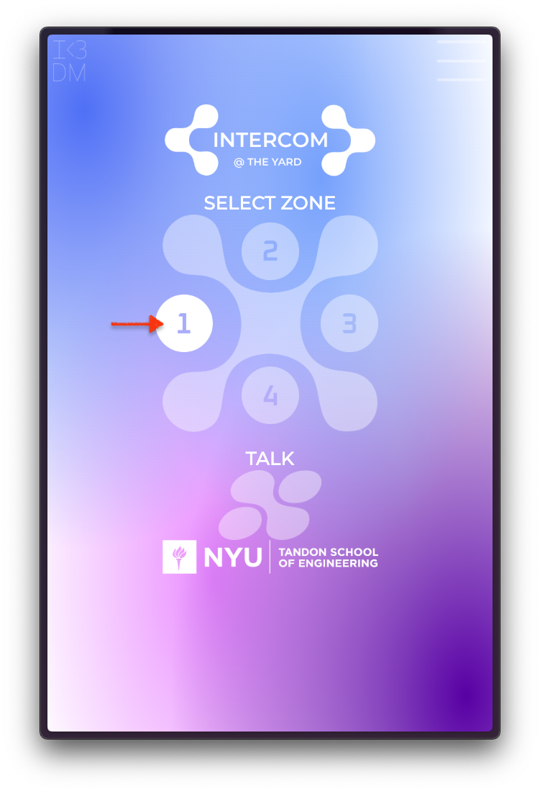
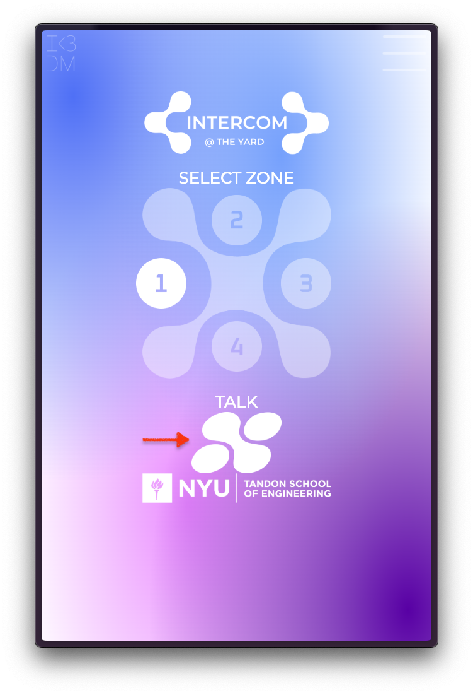
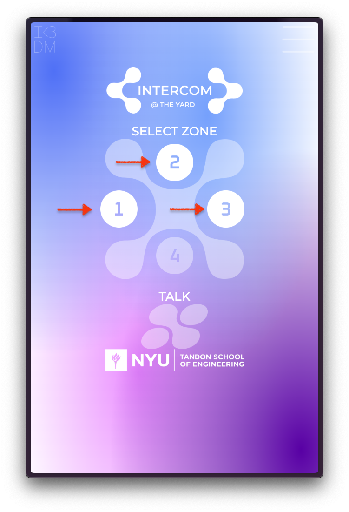
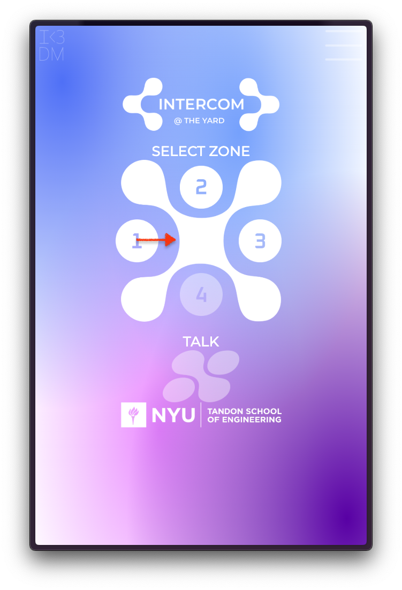

# Intercom at The Yard
A web application for intercom style 📢 voice communication 🗣️ 🔈 between different "zones" at NYU Tandon at The Yard. The intercom system is used for announcements mostly during public events and showcases.

*intercome* is made with p5LiveMedia by @vanevery, a WebRTC library for p5.js. For more information about p5LiveMedia see Shawn's [github repo](https://github.com/vanevery/p5LiveMedia) here.

This repo is intended to provide a starting point for DIY, networked, multi-zone announcement systems.



## Hardware
*Intercom-at-the-Yard* is run in the browser on Raspberry Pi computers connected to speakers at 4 sites in our facility. These are referred to as an *"endpoint"* in this repo.

Here is a picture of one of our endpoints 😌.


Oh my here is another! 🌸 How they are wise, listen to them!



## Installation 
With node installed run:
```
npm install
```

After dependencies are installed run:

```
npm run dev
```

You should now be able to test the app locally. 

## Deployment
I use vercel to deploy the repo using an environment variable in the build rules.

## Usage
Deploy the website using a unique *room name*. The *room name* is configured in the .env file. See the .env.example file in this repo. 

Change the environment variable to create a dedicated private channel for your intercom endpoints. Make sure this variable is hard to guess! Otherwise strangers might be able to make **weird noises** in your endpoints.

To designate a speaker/computer pair as an endpoint. Simply...

* connect a computer (we use small Raspberry Pi computers) to a loudspeaker and point it's browser to your hosted clone of this repo. 

* Click the hamburger 🍔 menu  and select a zone and click *submit*.  
  
To address the endpoint from a microphone simply...

* point your desktop or mobile browser (make sure it has a microphone connected 🎤) to your hosted clone of this repo. Select a zone using the touch interface  
   and hold down the *talk* button to send sound to the endpoint. 
 
* You can send audio to multiple zones. 

* You can also send sound to every zone using the *all button*.


## Attribution
Tommy Martinez @ogbabydiesal: hardware systems and programming

Ava Kling @avasion: Design

Shawn Van Every @vanevery: p5LiveMedia, main dependencies

Todd Bryant: Inspo and Encouragement

## Contact
For more information about the library contact bnyaccess@nyu.edu.